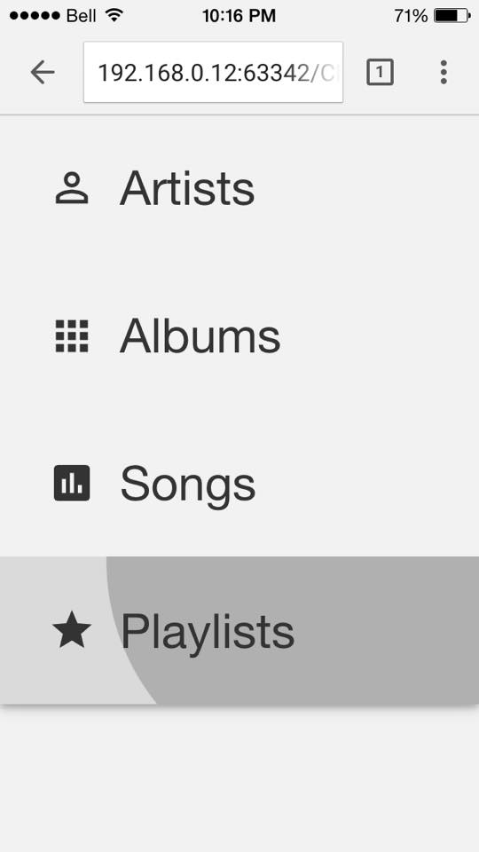

## Progress - Integrating Polymer

I've discovered Polymer HTML Elements and I'm never going back

February 12th, 2015

Polymer is this unique framework for creating truly modular web UI. It allows you to segregate each core UI element on your webpage, which you attach a script and stylesheet to that are sandboxed to that element. What this allows the developer to do is import a UI element in the same fashion they import Classes or other libraries. It's truly modular web programming but this time at the UI element level. 

In addition to the flexibility Polymer provides the developer they also have two UI libraries that work with Polymer out of the box: Core and Paper. Core Elements are mostly unstyled yet complete Polymer elements that can be extended with either Javascript or Dart to fit the developers needs. On the other hand Paper Elements are fully designed and elegant UI components which are based off of Google's Material Design Specs.

In CloudMusic, I will be using Polymer for the entire frontend design and more specifically Paper Elements. I find the aesthetics of Paper Elements to be very much aligned with my overall vision of CloudMusic's UI so instead of reinventing the wheel I will be leveraging their design in the creation of the app.



Until next time, I must get back to work.